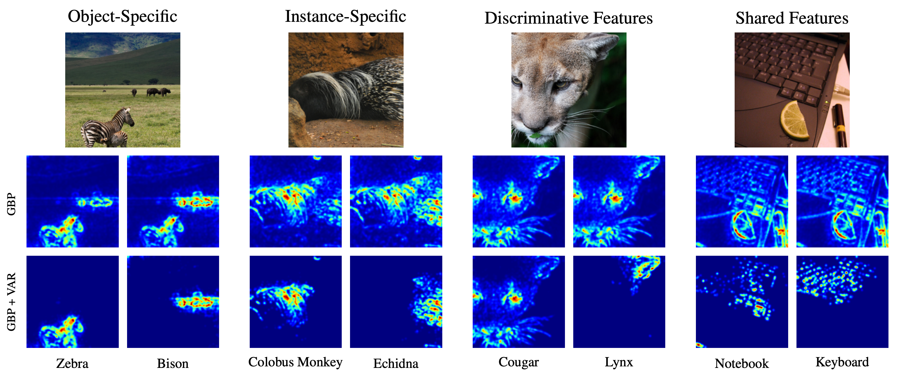
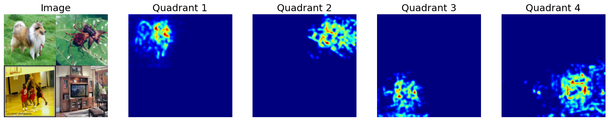

# Now you see me! A framework for obtaining class-relevant saliency maps 

<p align=center >

</p>

This is the Python implementation belonging to the paper [*Now you see me! A framework for obtaining class-relevant saliency maps*](https://arxiv.org/abs/2503.07346). We provide  a demo in a jupyter notebook to provide an easy starting point. 


## 1. Required packages
We provide a file that installs all the required libraries in `install.sh`. We use both conda and pip to install. 
- PyTorch
- Numpy
- Pandas
- Matplotlib
- opencv
- sklearn
- tqdm
- captum

We also provide an `environment.yaml` file, which can be installe via `conda env create -f environment.yml`.

## 3. Demo
In the jupyter notebook `demo.ipynb`, we provide a demo to show how to use 
<span style="font-variant:small-caps;">Var</span>. As an example, we the GridPointing-Game also discussed in the paper. We provide a simple wrapper `ClassSpecificAttributionWrapper`, which takes the model, the classes to compare against and the threshold tau. Then one can simply call the `attribute` method to generate class-relevant  attribution maps. The result should look as shown below.

<p align=center >

</p>

## 4. Credits
For Integrated Gradients, we use code of https://github.com/chasewalker26/Integrated-Decision-Gradients and for the transformers we adapt the code from 
https://github.com/hila-chefer/Transformer-Explainability.


## 5. Citation
If you find our work useful for your research, please consider citing:


```
@article{walter2025var,
  title = {Now you see me! A framework for obtaining class-relevant saliency maps},
  author = {Walter, Nils Philipp and Vreeken, Jilles and Fischer, Jonas},
  journal = {arXiv preprint arXiv:2503.07346},
  year = {2025},
  organization = {arXiv},
}
```

## 6. License
 <p xmlns:cc="http://creativecommons.org/ns#" >This work is licensed under <a href="https://creativecommons.org/licenses/by-nc-sa/4.0/?ref=chooser-v1" target="_blank" rel="license noopener noreferrer" style="display:inline-block;">CC BY-NC-SA 4.0</a></p> 


